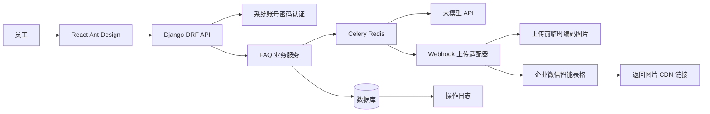

# 架构说明

## 总体架构



## 模块职责

- `accounts`：系统账号密码登录、本地用户和员工档案。
- `audit`：操作日志模型、日志写入服务、管理员查询接口。
- `faq`：批量任务、图片、问答草稿、上传记录、DRF API、Celery 任务。
- `integrations`：外部系统适配器，包括大模型 API、webhook 上传、图片编码。大模型接口使用 OpenAI SDK 的兼容客户端调用 DeepSeek。
- `frontend`：React + Ant Design 前端，使用项目 CSS 变量和卡片化布局实现企业级简洁视觉。

## 数据设计

- `BatchJob`：批量任务，记录状态、总数、已处理数、失败数和当前步骤。
- `UploadedImage`：上传图片，只保存本地文件路径、原文件名和用户填写的描述。
- `GenerationItem`：待生成问答的业务项，可以关联一张或多张图片；单图项和合并项都会参与 AI 生成。
- `FaqDraft`：大模型基于生成项生成的问答草稿，支持人工编辑。
- `WebhookConfig`：用户填写的 webhook 链接。
- `UploadRecord`：上传结果，保存问题、相似问题、答案、来源草稿 ID、企业微信记录 ID、企业微信返回字段和图片 CDN 链接。单条上传记录可以对应一个或多个问答草稿。
- `LlmUsageLog`：大模型调用用量日志，记录模型、输入 Token、输出 Token、总 Token、调用状态和错误信息。
- `AuditLog`：记录用户动作、对象、IP、User-Agent 和摘要。

## API 边界

- `GET /api/auth/me/`：获取当前登录用户。
- `POST /api/auth/login/`：系统账号密码登录。
- `POST /api/batches/`：创建批量任务。
- `POST /api/batches/{id}/images/`：上传多张图片。
- `PATCH /api/images/{id}/`：保存图片描述。
- `PUT /api/batches/{id}/generation-items/`：保存单图项和合并项。
- `POST /api/batches/{id}/generate/`：启动问答生成任务。
- `GET /api/batches/{id}/progress/`：查询任务进度。
- `GET /api/batches/{id}/drafts/`：查询生成结果。
- `PATCH /api/drafts/{id}/`：修改问答草稿。
- `POST /api/batches/{id}/upload-webhook/`：启动 webhook 上传任务。
- `GET /api/upload-records/`：查看上传记录。
- `GET /api/llm-usage/me/`：查看当前账号 Token 累计用量和最近调用明细。
- `GET /api/audit-logs/`：管理员查看操作日志。

## Webhook 字段映射

默认字段 ID：

```json
{
  "question": "f04Gwj",
  "similar_questions": "ftQMc5",
  "answer_text": "ftk5Tx",
  "answer_images": "fMAfWQ"
}
```

可以通过环境变量调整：

```bash
WECHAT_FIELD_QUESTION=f04Gwj
WECHAT_FIELD_SIMILAR=ftQMc5
WECHAT_FIELD_ANSWER=ftk5Tx
WECHAT_FIELD_IMAGES=fMAfWQ
```

上传 payload 中图片字段使用 `image_base64`。上传成功后，企业微信返回 `values.fMAfWQ[].image_url`，系统只保存该 CDN 链接和企业微信返回的结构化字段，不把本地图片路径或 base64 写入上传日志。

`POST /api/batches/{id}/upload-webhook/` 默认按每个草稿一条记录上传。草稿来自 `GenerationItem`，如果生成项关联多张图片，上传时会把这些图片一起放到同一条企业微信记录中。接口仍兼容可选 `upload_items`，用于后续扩展临时合并上传。

## 前端交互约束

- 页面整体使用企业后台布局：顶部品牌区、说明 Hero、卡片化 Tabs、统一数据卡片和浅灰背景。
- 新建任务页按上传、描述/合并、审核、上传结果拆分为流程卡片，合并生成项单独作为额外生成项展示。
- 历史任务、上传记录使用统一数据卡片承载表格；Token 用量页使用 KPI 卡片突出输入、输出和总 Token。
- 生成和 webhook 上传使用 Ant Design `Modal` + `Progress` 弹窗展示进度，任务开始后立即可见。
- 用户在填写描述阶段可以勾选多张图片新增合并项；合并项有独立描述，并会像单图项一样参与 AI 生成。
- 用户编辑 AI 返回结果后，如果没有逐条点击“保存当前修改”而直接上传 webhook，前端会先自动保存当前页面中的未保存修改，再启动上传。
- 新建任务页的一键清空只清空当前页面工作区，不删除数据库中的历史任务或上传记录。
- Token 用量页只展示当前登录账号自己的累计用量和最近明细。
- Django Admin 中项目模型、字段、列表展示和站点标题使用中文名称，便于后台运营查看。

## 平台化预留

- 认证通过 `accounts` 隔离，后续可以把企业微信 OAuth 替换成统一身份中心。
- 外部系统调用都在 `integrations`，未来可以替换大模型、对象存储或 webhook 目标。
- 业务流程集中在 `faq`，可以作为企业信息化平台中的一个独立业务模块迁移。
- 前端使用 React 和 Ant Design，后续可接入企业平台菜单、布局和权限基座。

